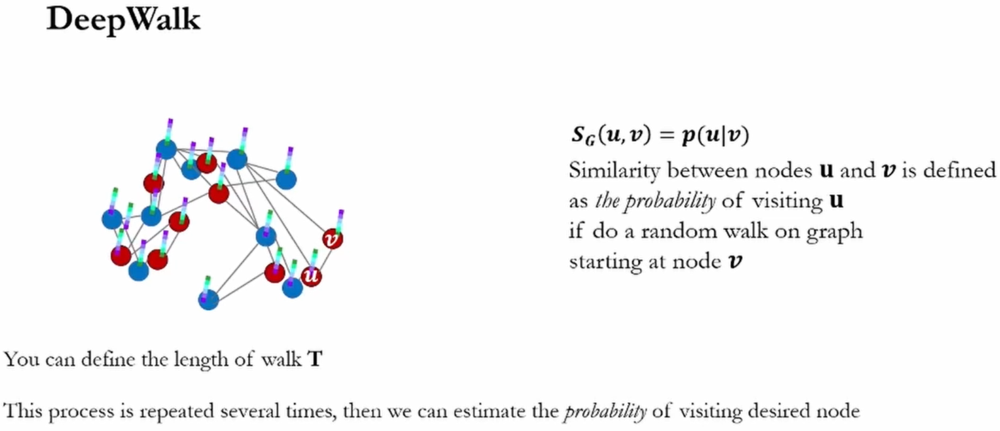

# Graph Neural Network

Source:
- https://snap.stanford.edu/class/cs224w-2023/
- https://www.youtube.com/playlist?list=PLoROMvodv4rPLKxIpqhjhPgdQy7imNkDn
- https://pytorch-geometric.readthedocs.io/en/latest/get_started/colabs.html

## Chapter 3. Node Embeddings (Shallow encoding: Deepwalk and Node2Vec)

## Chapter 5. Label Propagation for Node Classification

- Relational classification: Propagate node labels across the network. Iteratively update probabilities of node belonging to a label class based on its neighbors.
- Iterative Classification: Tabulate the incoming / outcoming predicted label information. Then train a classifier to classify each node based on its features as well as labels of neighbors; do that iteratively.
- Correct & Smooth

## Chapter 6. Graph Neural Networks 1: GNN Model

Can solve:
- Node classification - Predict a type of a given node
- Link prediction - Predict whether two nodes are linked
- Community detection - Identify densely linked clusters of nodes
- Network similarity - How similar are two (sub)networks

Average neighbor’s previous layer embeddings and matrix multiply the weights. So as long as the embedding length is fixed, the model can handle any number of neighbors.

## Chapter 7. Graph Neural Networks 2: Design Space

## Chapter 8. Applications of Graph Neural Networks

## Chapter 10. Knowledge Graph Embeddings

## Chapter 13. GNNs for Recommender Systems

